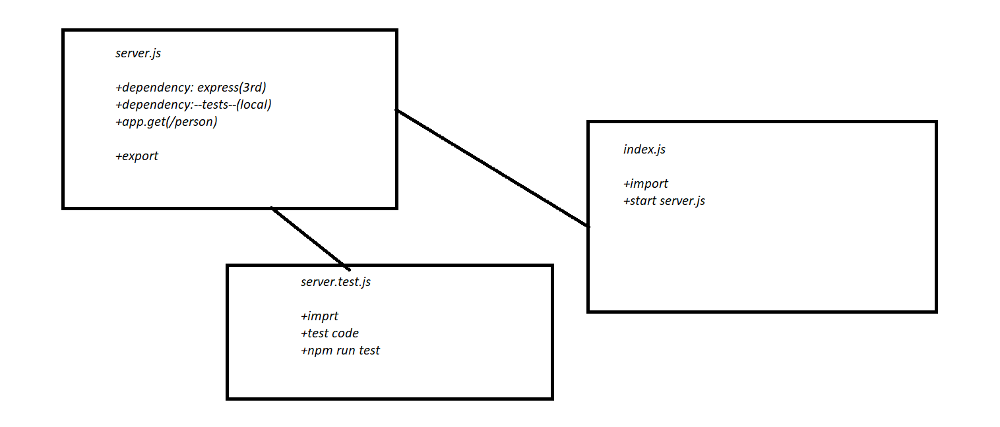

# basic-express-server

[Heroku Link](https://basic-osama-express-server.herokuapp.com/)

[tests report](https://github.com/Osamamomani1/basic-express-server/actions)

### Setup
`.env` requirements
* ` PORT` -3000


### Running the app

* `npm start`
* Endpoint: `person?name=Username`

```
{
    name:Username
}

```

### Tests

Unit Tests: `npm run test`

### diagram 

